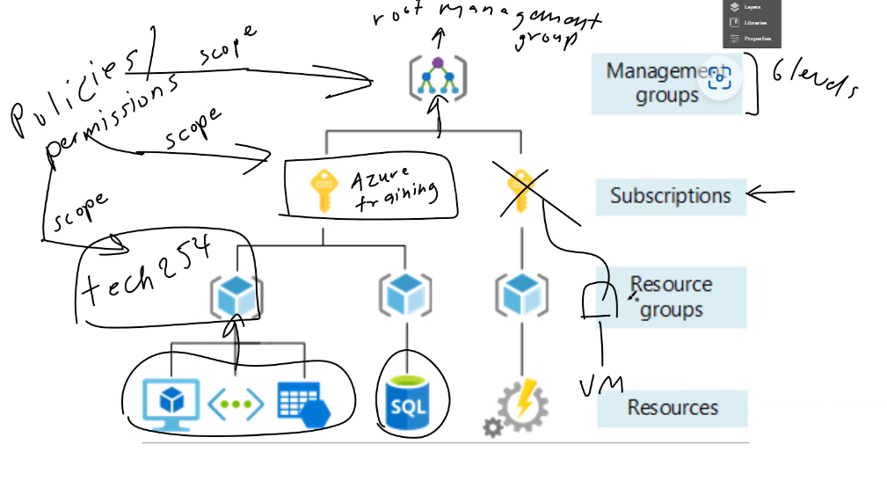
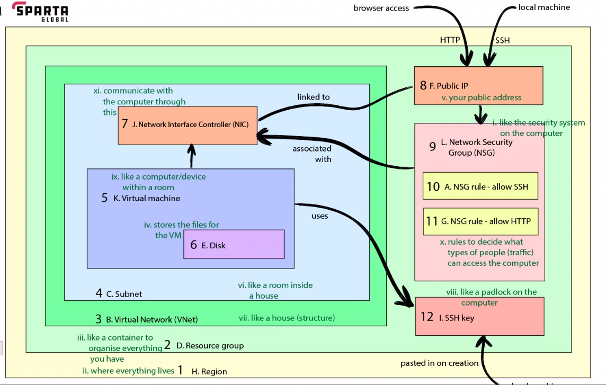

### What is Azure?

Azure, commonly referred to as Microsoft Azure, is a comprehensive cloud computing platform and service created by Microsoft. 

It provides a variety of cloud services, including those for computing, analytics, storage, and networking. 

Users can choose and configure these services to meet their specific needs. 

### Azure structure

Within Azure, there are 4 primary levels known as **scopes**.

**Management groups**
- Highest level in Azure hierarchy
- Management groups enable the application of policies across various levels, providing a centralized approach to compliance and access management. 

**Subscriptions**
- Function as containers for billing and resource administration.
- Subordinate to Management Groups.

**Resource Groups**
- A resource group, can hold individual resources or a single item, though it is limited by the associated subscriptions. 
- Every creation within Azure, from virtual machines to databases, needs to be placed within a resource group. 

**Resources**
- All resources in Azure are organized within resource groups, ensuring efficient management and organization.

### Virtual Machine Structure

