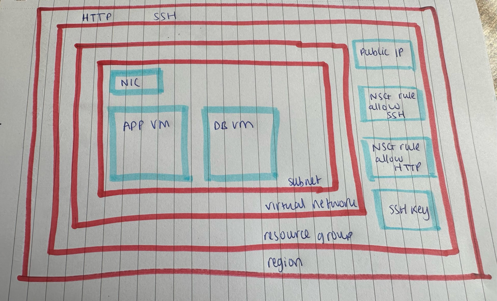

### What is Azure?

Azure, commonly referred to as Microsoft Azure, is a comprehensive cloud computing platform and service created by Microsoft. 

It provides a variety of cloud services, including those for computing, analytics, storage, and networking. 

Users can choose and configure these services to meet their specific needs. 

### Azure structure

Within Azure, there are 4 primary levels known as **scopes**.

**Management groups**
- Highest level in Azure hierarchy
- Management groups enable the application of policies across various levels, providing a centralized approach to compliance and access management. 

**Subscriptions**
- Function as containers for billing and resource administration.
- Subordinate to Management Groups.

**Resource Groups**
- A resource group, can hold individual resources or a single item, though it is limited by the associated subscriptions. 
- Every creation within Azure, from virtual machines to databases, needs to be placed within a resource group. 

**Resources**
- All resources in Azure are organized within resource groups, ensuring efficient management and organization.

### 1 Tier Architecture Deployment Structure

### 2 Tier Architecture Deployment Structure

### System routes - What routes do they allow by default?

System routes are the default routes provided by Azure to allow communication within a virtual network, and to communicate to the Azure infrastructure.  

By default, Azure allows the following routes for system routes:

1. *VNet-to-VNet Communication*
2. *Internet Communication*
3. *Virtual Network Gateway Communication*
4. *Virtual Appliances*

### User-defined routes (or custom routes) - how to use them to make a subnet private

- In Azure, you can use user-defined routes (UDRs) to control the flow of network traffic within your virtual network (VNet) and between VNets.  

- Specifically, you can use UDRs to make a subnet private by controlling the traffic flow in and out of the subnet. 