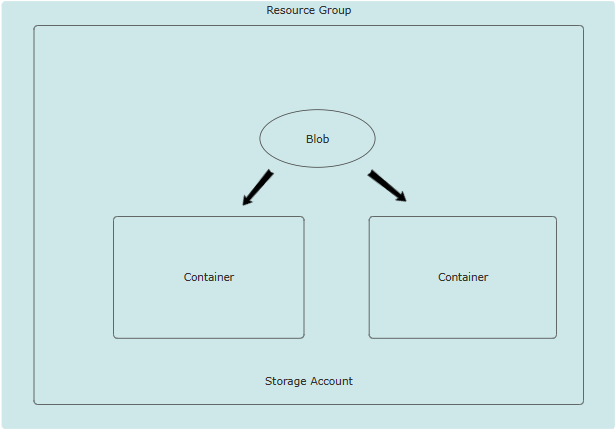
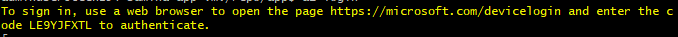
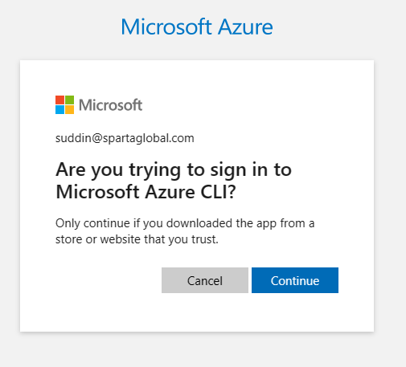
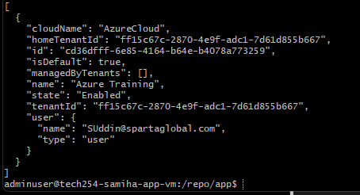
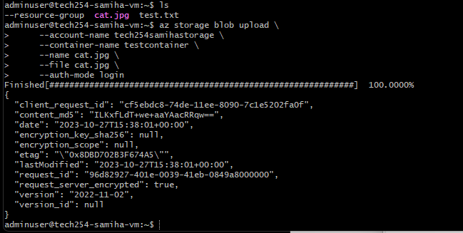

### What is Azure Blob Storage?

Azure Blob Storage is Microsoft Azure's object storage solution for the cloud.

Azure Blob Storage is highly scalable and can store and serve large amounts of unstructured data.

It is commonly used for backups, archiving, data lakes, IoT data, and much more.

### 3 Types of Blob Storage?
- Block blobs
- Page blobs
- Append blobs



### Blob Storage 
- You can store anything in blob storage such as Videos, pictures 
- It needs a storage account, you cannot create a blob without one. 
- A blob storage is unorganised and blobs go inside a container.
- In order to organise the containers, you will need to create a new container.
- The storage account belongs inside our resource groups.

### Access Tiers 

- Access tiers in Azure Blob Storage refer to the different storage classes that allow you to store your data at different levels of durability and access costs. 

There are 3 different access tiers: <br>
- **Hot Access Tier:** This tier is optimized for frequently accessed data. <br>
- **Cool Access Tier:** This tier is optimized for infrequently accessed data. <br>
- **Archival Tier:** This is used when it is hardly ever accessed. 

### Redundancy options with blob storage
- **Local Redundancy Storage (LRS):** LRS replicates your data three times within a storage scale unit in a datacenter. This replication is done within the same region.
- **Zone Redundancy Storage (ZRS):** ZRS replicates your data in availability zones, ensuring data residency and resiliency within the same region. Availability zones are unique physical locations within an Azure region.

### How to stop App running

**Step 1:** SHH into Gitbash terminal <br>
**Step 2:** Change from Root to User 
```
cd /
```
**Step 3:** Then enter app folder
```
cd repo
ls
cd app
```

**Step 4:** Check if node is running
```
# list files in app 
ls

# display a list of all running Node.js processes
pm2 list

# starting Node.js app using PM2
pm2 start app.js

# running Node.js
node app.js
```

**Step 5:** Stopping Node.js from running

```
# list all the processes running
ps aux 

# lists only node processes
ps aux | grep node

# In order to kill node we need to kill pm2 as this keeps restarting node 
ps aux | grep pm2
sudo kill 17307
```

### How to set up Azure CLI

**Step 1:** Install Azure CLI
- Navigate to Azure CLI Installation Guide.
https://learn.microsoft.com/en-us/cli/azure/install-azure-cli-linux?pivots=apt
- Select `Install Linux`
- Navigate to `Option 1: Install with one command`
- Copy and paste the command into the GitBash terminal
```
curl -sL https://aka.ms/InstallAzureCLIDeb | sudo bash
```

**Step 2:** Login to Your Azure Account

```
az login
```
**Step 3:** Follow the steps in the terminal 
- Copy and paste the URL in a browser
- Enter the code given from the terminal
- Login through your Microsoft Azure email and password.
- Press continue




### Successful output 



### Create a Storage Account
```
az storage account create 
--name tech254samihastorage 
--resource-group tech254 
--location uksouth 
--sku Standard_ZRS
```

### Create a Container 
```
az storage container create \
     --account-name tech254samihastorage \
     --name testcontainer \
     --auth-mode login
```

### Downloading cat image

```
curl -o cat.jpg  https://upload.wikimedia.org/wikipedia/commons/thumb/4/48/RedCat_8727.jpg/1200px-RedCat_8727.jpg

# check if cat image is there
ls
```

### Uploading Cat image to blob
```
az storage blob upload \
     --account-name tech254samihastorage \
     --container-name testcontainer \
     --name cat.jpg \
     --file cat.jpg \
     --auth-mode login
```

**Expected output**



### Making the blob public (Manually)

**Step 1:** Navigate to `Storage Account`
- Find and click on the storage account you have created

**Step 2:** Navigate to `containers`

**Step 3:** Making blob public
- Click on the container you have created
- Click `Change access level`
- Change anonymous access level to `Blob`

**Step 4:** Click on blob and launch the URL

### Modifying homepage file 
```
sed -i '/<h2>/i\' /home/adminuser/repo/app/views/index.ejs
```
