## Creating SSH Key on Azure

**Step 1:** Generate an SSH Key pair locally 
- Navigate to your GitBash terminal 
- Enter your .ssh folder `cd .ssh`
- Generate a new key pair: `ssh-keygen -t rsa -b 4096 -C "samihauddin@live.co.uk"`
- Press Enter and name the key appropriately

#### Uploading the Public key to Azure Portal 

**Step 2:** Login to Azure Portal
- https://portal.azure.com/signin/index/

**Step 3:** Navigate to the SSH Keys Section 

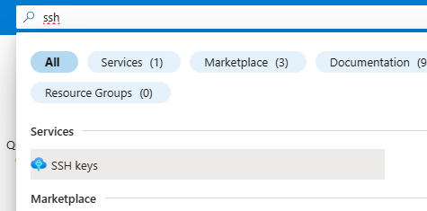

**Step 4:** Add SSH Key
- Select `Create SSH Key`
- Enter your Key pair name
- Select `Upload existing public key`
- Copy and paste your public SSH that you created in step 1


**Step 5:** Create a Tag
- Name `Owner`
- Value `Your Name`

**Step 6:** Review and Create
- Review input and then select create


## Creating a Virtual Network on Azure

**Step 1:** Login to Azure Portal
- https://portal.azure.com/signin/index/

**Step 2:** Navigate to Virtual Network
- In the top search bar enter Virtual Network


**Step 3:** Configure VNet Settings

- Select `Create`
- Enter a Virtual network name
- Region: `Europe UK South`


**Security**
- Leave as default

**IP addresses**
- Enter the IP address range for your VNet `10.0.0.0/16`
- Create a public subnet
- Create a private subnet


**Create a Tag**
- Name `Owner`
- Value `Your Name`

**Review and Create**
- Review your configurations to ensure everything is correct.
- Click on the "Review + create" button to validate your settings.
- After validation passes, click on the "Create" button to create your VNet.


**Successful output**


## Creating a VM on Azure

**Step 1:** Login to Azure Portal
- https://portal.azure.com/signin/index/

**Step 2:** Navigate to Virtual Machine
- In the top search bar enter Virtual Machine
- Select `Create`
- Select `Azure Virtual Machine`


**Step 3:** Project Details
- Name appropriately 
- Select `Availibilty Zone`
- Select `Zone 1`

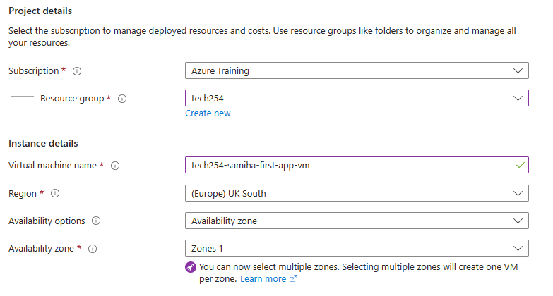

**Step 4:** Security type

`Ubuntu Pro 10.04 LTS x64 Gen2` <br>
`Standard`


**Step 5:** VM size 
- Click `see all sizes`
- Search `B1s` and select


**Step 6:** Administrator account 
- Change default username to `adminuser`
- Select `Use existing key stored in Azure`
- Select your key name


**Step 7:** Inbound port rules
- Select HTTP (80) and SSH (22)


**Step 8:** OS Disk
- Standard SSD
- Check Delete with VM

**Step 9:** Networking 
- Select your Virtual Network
- Select `Public Subnet`
- NIC network security group `Basic`
- Check Delete Public IP and NIC when VM is deleted


Step 10: Management and Monitoring
- Leave as default

Step 11: Advanced
- Check `Enable User data`
- Enter your script


**Step 12:** Create a Tag
- Name `Owner`
- Value `Your Name`

**Step 13:** Review and Create
- Review your configurations to ensure everything is correct.
- Click on the "Review + create" button to validate your settings.
- After validation passes, click on the "Create" button to create your Virtual Machine.


**Successful output**
- You can now copy and paste your public IP address 

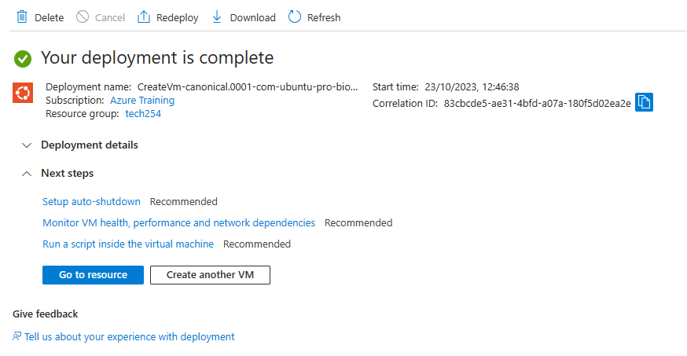

## SSH into Gitbash manually

- Navigate to your resource that you have created
- Select `connect`
- Select `Native SSH`
- Copy and execute SSH command: `Enter the path to your private key`
- SSH to VM with specified private key

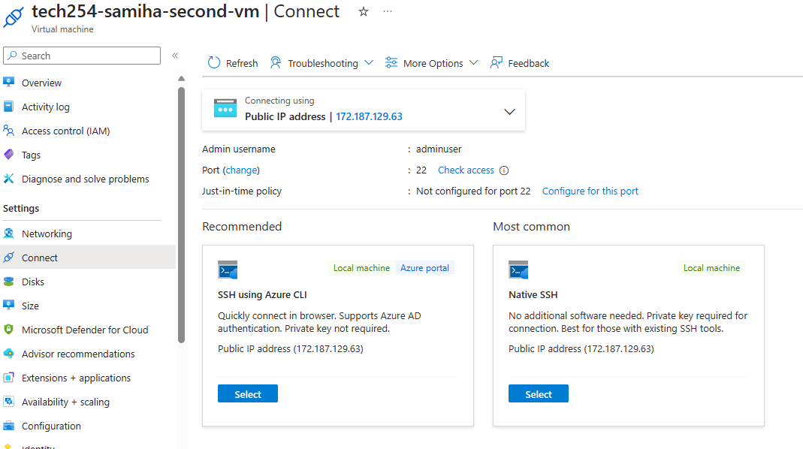
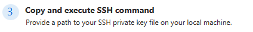

## Troubleshooting - Launching APP VM 

When a VM was created using the script which was entered into the User Data. The Sparta Test app did not launch.

**In order to overcome this:**

1. Run the Script manually and see if any manual intervention is identified
2. Blocker identified 
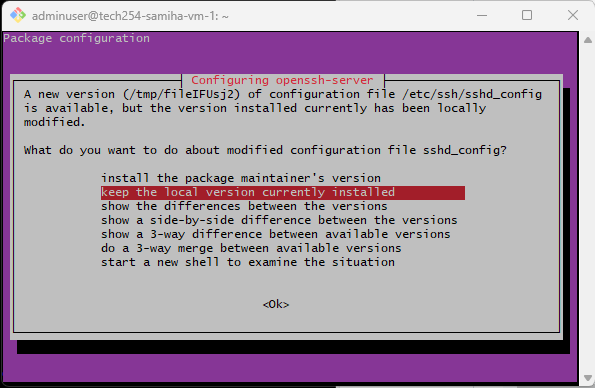
3. Identify the command that overrides this manual interventions. 
```
sudo DEBIAN_FRONTEND=noninteractive apt-get upgrade -y -o Dpkg::Options::="--force-confnew"
```

4. Create a script and test on a new VM
5. Launch a new VM and input the script in the user data section.

**Successful output**

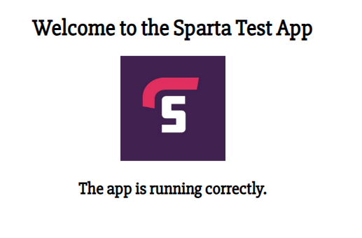

## Launching DB VM 

**Step 1**: Launch a new VM 
- Follow the same steps as you would launch a new VM, until networking configurations <br>

**Step 2:** Networking 
- Select your Virtual Network
- Select `Private Subnet`
- NIC network security group `Advanced`
- Select `create new`
- Select `add inbound rule`
- Add in MongoDB security rule

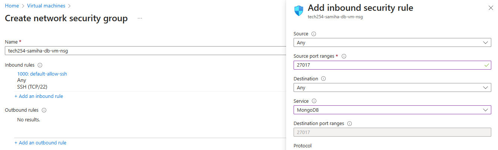
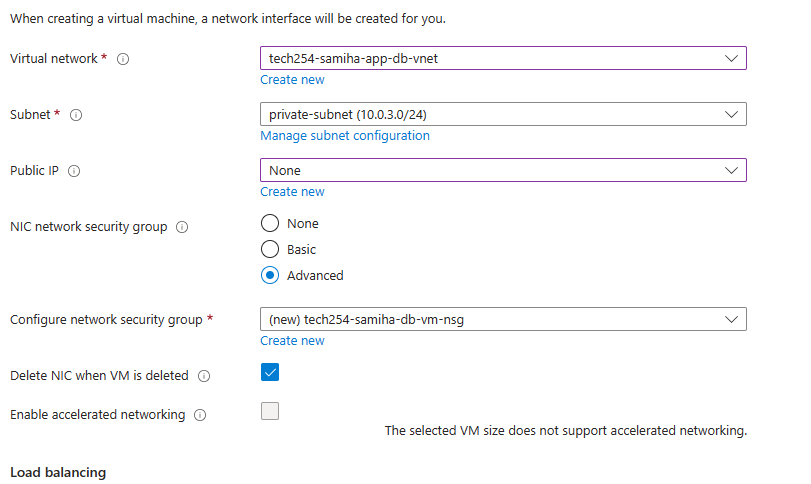

- Check Delete Public IP and NIC when VM is deleted

**Step 3:** Advanced
- Check `Enable User data`
- Enter your script


**Step 4:** Create a Tag
- Name `Owner`
- Value `Your Name`

**Step 5:** Review and Create
- Review your configurations to ensure everything is correct.
- Click on the "Review + create" button to validate your settings.
- After validation passes, click on the "Create" button to create your Virtual Machine.

**Successful output**

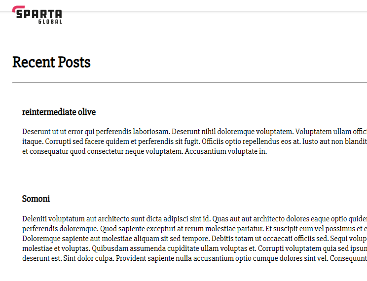

### 2 Tier Architecture Deployment


### How to make private subnet more secure?

**Step 1:** Navigate to DB Virtual Machine
- select `Networking` <br>

Click on SSH rule
- Change Source: `IP Addresses`
- Source IP addresses: `enter public IP address`
- Change priority

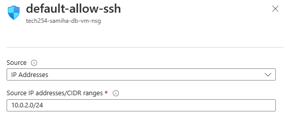

Click on MongoDB rule

- Change Source: `IP Addresses`
- Source IP addresses: `enter public CIDR block`
- Change priority

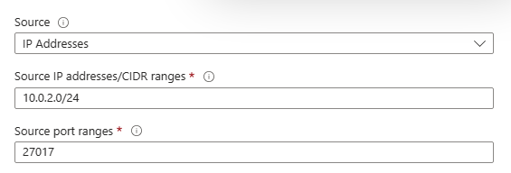

**Successful output: sources have now been changed**

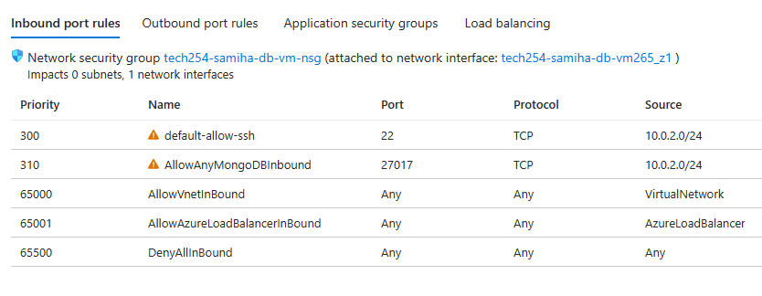

### How to unassociate a public IP address from a NIC 

Navigate to App Virtual Machine
- select `Networking` <br>
- Select Networking Interface link 
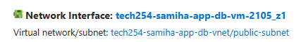
- Select IP cofigurations <br>
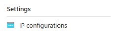
- Click on `ipconfig1`
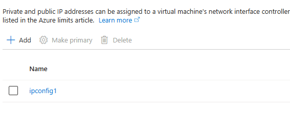
- Uncheck `Associate public IP address`
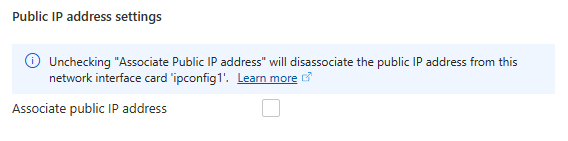

**Successful output: IP address unlinked**

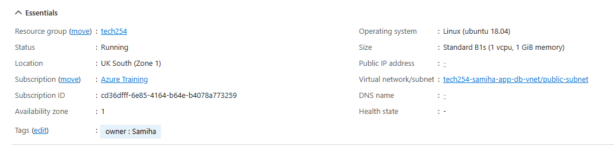